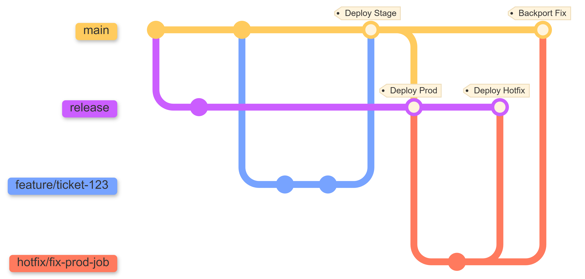

# CI/CD Setup Guide for my_data_project

This project includes pre-configured CI/CD pipelines for **github_actions**.

## Prerequisites

### Repository Structure

The CI/CD pipeline expects the bundle project to be at the **root** of the repository:

```
my_data_project/
├── databricks.yml           # ← Must be at repo root
├── .github/
│   └── workflows/
├── resources/
├── src/
├── tests/
└── ...
```

### Required Tools

- **Databricks CLI** (installed automatically by the pipeline)
- **Python 3.11+** (for running unit tests)

---

## Unity Catalog Prerequisites

Before CI/CD can deploy resources, Unity Catalog catalogs must exist and service principals must have appropriate permissions.

### Understanding Service Principal Roles

This template uses a **single service principal per environment** that serves as both:
- **Deployer**: Authenticates the Databricks CLI to run `databricks bundle deploy` in CI/CD
- **Runtime**: Executes jobs and pipelines (configured via `run_as` in `databricks.yml`)

The service principal configured for CI/CD authentication should be the same one specified as `stage_service_principal` and `prod_service_principal` in `variables.yml`. The CI/CD pipeline authenticates as this SP to deploy bundles, and the `run_as` directive ensures deployed jobs execute under the same identity.

> **Advanced**: It is technically possible to use different SPs for deployment and runtime (e.g., a deployment SP with workspace-level permissions and a separate runtime SP with specific data access). In that case, configure the CI/CD variables with the deployer SP credentials and `variables.yml` with the runtime SP's application ID. However, this template assumes a single SP per environment for simplicity.

### Step 1: Verify Catalog Access

Ensure the following pre-existing catalogs are accessible (created by your platform/infra team):
- `stage_analytics`
- `prod_analytics`

> **Note**: The `user` target shares the `dev_analytics` catalog with per-user schema prefixes and doesn't require CI/CD access.

### Step 2: Add Service Principal to Workspace

Before granting Unity Catalog permissions, ensure the service principal is added to your Databricks workspace:

1. Go to your workspace → Settings → Identity and access
2. Click Service principals → Add service principal
3. Add your relevant stage/prod SPs

### Step 3: Grant Catalog Permissions

The service principal only needs **catalog-level** permissions. Schema-level grants are handled automatically by the bundle deployment (defined in `databricks.yml`).

> Don't have a service principal yet? See [Creating OAuth M2M Credentials](#creating-oauth-m2m-credentials) below for step-by-step instructions, then return here to grant catalog permissions.

**Identify your Service Principal**: In Databricks Account Console → User management → Service principals → your SP, copy the **Client ID** from the OAuth secrets section.

```sql
-- STAGING Environment Permissions
-- Replace <STAGING_SP_ID> with your staging service principal's application/client ID
GRANT USE CATALOG ON CATALOG stage_analytics TO `<STAGING_SP_ID>`;
GRANT CREATE SCHEMA ON CATALOG stage_analytics TO `<STAGING_SP_ID>`;

-- PRODUCTION Environment Permissions
-- Replace <PROD_SP_ID> with your production service principal's application/client ID
GRANT USE CATALOG ON CATALOG prod_analytics TO `<PROD_SP_ID>`;
GRANT CREATE SCHEMA ON CATALOG prod_analytics TO `<PROD_SP_ID>`;
```

Schema permissions are automatic: When the bundle deploys and creates schemas, the SP becomes the schema owner. Additional grants defined in `databricks.yml` (for groups like `developers`, `qa_team`, etc.) are applied automatically during deployment.

#### **Why these permissions?**

| Permission | Purpose |
|-----------|---------|
| `USE CATALOG` | Access the catalog hierarchy |
| `CREATE SCHEMA` | Create bronze, silver, gold schemas during first deployment |

Note that you might want to grant other `CREATE <SECURABLE>` privileges e.g. to create Volume via DABs.

**What you DON'T need to grant manually:**
- Schema-level privileges (SP owns schemas it creates)
- Table-level privileges (inherited from schema ownership)

---

## Git Branching Strategy

This project uses an **environment-branch promotion model** based on [GitLab Flow](https://about.gitlab.com/topics/version-control/what-is-gitlab-flow/). Feature branches merge into the default branch (staging), which promotes to the release branch (production). It is simpler than [Gitflow](https://www.atlassian.com/git/tutorials/comparing-workflows/gitflow-workflow) (no `develop` branch) and more structured than [GitHub Flow](https://docs.github.com/en/get-started/using-github/github-flow) (explicit production gating via a long-lived release branch). This pattern is well-suited for data pipeline projects where stability matters more than rapid feature shipping.


> **Branch name mapping**: The diagram above uses generic branch names. In your project: **`main`** is configured as the staging integration branch and **`release`** as the production release branch. Map any references to "main"/"release" in the diagram to your configured branch names.

### Branch Purposes

| Branch | Environment | Purpose | CI/CD Trigger |
|--------|-------------|---------|---------------|
| `feature/*` | **User** | Development work | None (Developers run `bundle validate` locally) |
| `main` | **Staging** | Integration & Pre-prod | **PR**: Validates bundle<br>**Merge**: Deploys to Staging |
| `release` | **Production** | Production Releases | **Merge**: Deploys to Production |

### Workflow Steps

1. Create feature branch from `main`
2. Develop and test locally using `databricks bundle validate -t user`
3. Open Pull Request to `main`
   - CI pipeline runs unit tests
   - CI pipeline validates bundle for staging and production
4. Merge to `main` after approval
   - CD pipeline deploys to staging environment
5. Open Pull Request from `main` to `release`
   - Review changes for production readiness
   - No CI validation runs (already validated on `main`)
6. Merge to `release`
   - CD pipeline deploys to production environment

### Hotfix Workflow

For production issues, we recommend:

1. **Fix Forward (Preferred)**: Pause the broken job in the workspace, then push the fix through the normal `feature/*` → `main` → `release` flow. This is almost always possible for data pipelines because they tolerate short delays better than user-facing services. This ensures full validation.

2. **Upstream-First (Emergency)**: When you cannot wait (e.g., a corrupted table blocking downstream consumers):
   - Create a branch from `main`, fix the issue, and merge to `main` (ensuring it passes CI)
   - Cherry-pick the merge commit to `release` for immediate deployment
   - *Why?* This prevents regression bugs where a hotfix exists in production but is overwritten by the next staging deployment because it never made it to the main branch

> **Advanced:** You can create a `hotfix/*` branch from `release`, merge it directly to `release`, then cherry-pick the fix back to `main`. However, this bypasses CI validation on the main path — treat it as an emergency escape hatch only, not a routine practice.

---

## Pipeline Overview

| Pipeline Stage | Trigger | Action |
|---------------|---------|--------|
| Bundle CI | Pull Request to `main` | Runs unit tests and validates bundle configuration |
| Staging CD | Merge to `main` | Deploys bundle to staging environment |
| Production CD | Merge to `release` | Deploys bundle to production environment |

---

## GitHub Actions Setup

### Step 1: Configure Repository Secrets

1. Go to your GitHub repository
2. Navigate to **Settings** → **Secrets and variables** → **Actions**
3. Click **New repository secret** for each secret listed below

#### Secrets for AWS/GCP Databricks (OAuth M2M Authentication)

| Secret Name | Value Source (Databricks) |
|-------------|--------------------------|
| `STAGING_DATABRICKS_HOST` | Your Databricks workspace URL (e.g., `https://xxx.cloud.databricks.com`) |
| `STAGING_DATABRICKS_CLIENT_ID` | Account Console → User management → Service principals → [your SP] → OAuth secrets → **Client ID** |
| `STAGING_DATABRICKS_CLIENT_SECRET` | Account Console → User management → Service principals → [your SP] → OAuth secrets → **Secret** |
| `PROD_DATABRICKS_HOST` | Same as above, for production workspace |
| `PROD_DATABRICKS_CLIENT_ID` | Same as above, for production SP |
| `PROD_DATABRICKS_CLIENT_SECRET` | Same as above, for production SP |

#### Creating OAuth M2M Credentials

1. Go to Databricks Account Console (accounts.cloud.databricks.com)
2. Navigate to **User management → Service principals**
3. Create or select a service principal for each environment
4. Generate OAuth secret:
   - Go to **OAuth secrets** tab → **Generate secret**
   - Copy Client ID → `*_DATABRICKS_CLIENT_ID`
   - Copy Secret (shown only once!) → `*_DATABRICKS_CLIENT_SECRET`
5. Add to workspace:
   - Go to **Workspaces → [your workspace] → Settings → Identity and access**
   - Add the service principal
6. Grant Unity Catalog permissions (see above)

### Step 2: Verify Workflow File

The workflow file is located at:
```
.github/workflows/my_data_project_bundle_cicd.yml
```

This workflow is triggered on:
- **Pull requests** to `main`: Runs unit tests and validates bundle configuration
- **Push** to `main`: Deploys to staging environment
- **Push** to `release`: Deploys to production environment
- **Manual dispatch**: Run workflow manually via GitHub Actions UI

### Step 3: Enable GitHub Actions

If GitHub Actions is not already enabled for your repository:

1. Go to your repository **Settings** → **Actions** → **General**
2. Under "Actions permissions", select **Allow all actions and reusable workflows**
3. Under "Workflow permissions", select **Read and write permissions**
4. Click **Save**

### Step 4: Configure Branch Protection (Recommended)

For better code quality, set up branch protection rules:

1. Go to **Settings** → **Branches**
2. Click **Add branch ruleset**
3. For branch name pattern: `main`
4. Enable the following:
   - **Require a pull request before merging**
      - **Require approvals**: 1 or more
   - **Require status checks to pass before merging**
      - Search and add: `Validate and Test` (see note below)
   - **Require conversation resolution before merging**
5. Click **Create** or **Save changes**

> **Note**: The `Validate and Test` status check will only appear in the search after you've run the workflow at least once. Create a test PR first, then return here to add the status check requirement.

**For the release branch**:
1. Repeat the above for `release`
2. Consider stricter policies for production (e.g., 2+ required approvals)

---

## Unit Tests

The CI pipeline automatically runs unit tests before bundle validation. Tests are discovered in the `tests/` directory.

### Running Tests Locally

```bash
# Install development dependencies
pip install -r requirements_dev.txt

# Run tests
pytest tests/ -V
```

### Test Structure

```
tests/
├── __init__.py
├── test_placeholder.py    # Example test (replace with your tests)
└── ...                    # Add your test files here
```

---

## Troubleshooting

### Pipeline fails with "Variable group not found"

- Ensure the variable group is named exactly: `vg_my_data_project`
- Check that the variable group is linked to the pipeline (first run: click "Permit")

### Pipeline fails with "databricks.yml not found"

- Ensure `databricks.yml` is at the repository root
- This template requires the bundle project to be at the repo root, not in a subdirectory

### Pipeline fails with authentication errors
- Verify that `DATABRICKS_HOST` is correct (include `https://`)
- Verify OAuth credentials: `DATABRICKS_CLIENT_ID` and `DATABRICKS_CLIENT_SECRET`
- Ensure the service principal has been added to the Databricks workspace
- Check that the SP has appropriate Unity Catalog permissions

### Bundle validation fails with "Catalog not found"

- Create the required catalog: `stage_analytics` or `prod_analytics`
- Grant the service principal `USE CATALOG` permission

### Bundle deployment fails with permission errors

- Ensure the service principal has `CREATE SCHEMA` on the catalog
- After schemas are created, grant `ALL PRIVILEGES` on each schema

### Tests fail

- Run `pytest tests/ -V` locally to see detailed output
- Check that all test dependencies are in `requirements_dev.txt`

---

## Related Documentation

- [Databricks Asset Bundles](https://docs.databricks.com/dev-tools/bundles/index.html)
- [Databricks CLI Reference](https://docs.databricks.com/dev-tools/cli/databricks-cli.html)
- [OAuth M2M Authentication](https://docs.databricks.com/dev-tools/auth/oauth-m2m.html)
- [Unity Catalog Privileges](https://docs.databricks.com/data-governance/unity-catalog/manage-privileges.html)
- [GitHub Actions Documentation](https://docs.github.com/en/actions)
